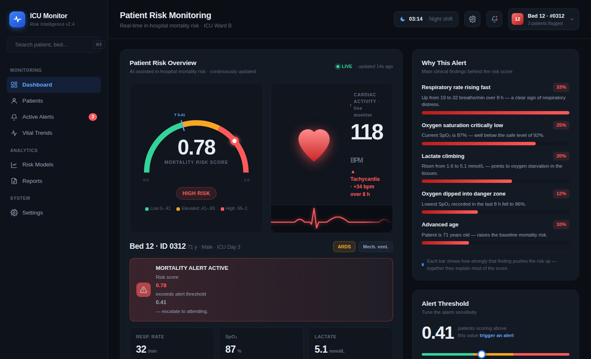

# ICU Mortality Prediction — Smart Hospital

**Politecnico di Milano · Smart Hospital course · 2025–2026**
Daniele Uras · Filippo Saccomano

An end-to-end machine learning pipeline that predicts in-hospital mortality from intensive-care vital-sign time series, with explainable outputs and a clinician-facing dashboard.



**[Live dashboard](https://daniele22-u.github.io/smart_hospital_polimi/dashboard/)** · **[Task report (IT/EN)](https://daniele22-u.github.io/smart_hospital_polimi/reports/task_report.html)** · **[Notebook](notebooks/icu_mortality_prediction.ipynb)**

---

## Overview

The data is a synthetic cohort inspired by MIMIC-III: 500 ICU patients, 1,717 observations in long format (2–5 timesteps per patient), 10 diagnoses, 12.6% mortality. The class imbalance (about 7:1) drives most of the method choices: AUROC and average precision instead of accuracy, stratified folds, and SMOTE applied only inside the training folds.

The project starts from the course's reference pipeline (notebook sections 1–9) and extends it with five tasks (section 10 and the dashboard):

| | Task | What we did | Main finding |
|---|---|---|---|
| 1 | Alert threshold calibration | Re-optimised the alert threshold for false-negative costs of 3, 8 and 12 | Shows the sensitivity/specificity trade-off a clinician actually chooses between |
| 2 | New temporal feature | Added intra-patient variability (IQR) for every temporal variable, retrained XGBoost, re-ran SHAP | WBC, GCS and troponin variability are the most informative; gain is small because with 2–5 timesteps IQR overlaps with min/max |
| 3 | 1D-CNN architecture | Third Conv1D layer, 32→64 filters, BatchNorm | The deeper model is worse (AUROC 0.778 → 0.766): capacity must match such short sequences |
| 4 | Subgroup analysis | Ensemble AUROC broken down by diagnosis | From 0.957 (trauma) to 0.758 (diabetes): a single global AUROC hides large gaps |
| 5 | Clinical dashboard | Interactive mock-up of a bedside risk monitor with plain-language SHAP explanations and a tunable alert threshold | — |

## Models

All models use the same 5-fold stratified cross-validation splits, so the out-of-fold (OOF) predictions are comparable and can be combined.

| Model | OOF AUROC | OOF AP |
|---|---|---|
| XGBoost (engineered features + SMOTE) | 0.865 | 0.510 |
| 1D-CNN (temporal) | 0.792 | 0.390 |
| Weighted ensemble | 0.838 | 0.534 |

Features: per-variable mean, last, delta, min, max and slope over the stay, static clinical data, the NEWS2 early-warning score and a few clinical interaction terms. Explainability: SHAP (global importance, per-patient force plots, dependence plots) and LIME.

> These numbers come from a synthetic dataset and are meant to compare methods within the project, not to suggest clinical performance.

## Repository structure

```
notebooks/icu_mortality_prediction.ipynb   full pipeline + tasks 1–4 (with outputs)
reports/task_report.html                   bilingual report with results and clinical interpretation
dashboard/index.html                       task 5: clinical dashboard mock-up (self-contained HTML)
docs/dashboard.png                         dashboard screenshot
data/README.md                             dataset description (data not included)
requirements.txt
```

## How to run

```bash
python -m venv .venv && source .venv/bin/activate
pip install -r requirements.txt
# put the course dataset at data/dataset.csv (see data/README.md)
jupyter notebook notebooks/icu_mortality_prediction.ipynb
```

The notebook was developed on Kaggle/Colab (Python 3.12, TensorFlow 2). The dashboard and the report are plain HTML files: open them in a browser, no server needed.
